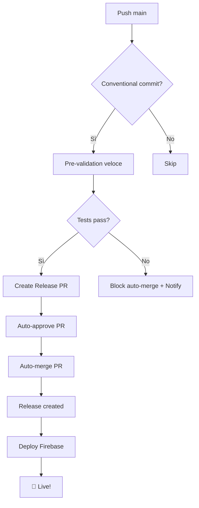

# Auto-Merge Release PR Implementation

## 🎯 **Nuovo Comportamento Automatico**

Il workflow release-please è stato aggiornato per eliminare completamente l'intervento manuale.

### **🔄 Flusso Completamente Automatico**



### **⚡ Da Commit a Deploy in ~8-10 minuti**

1. **Pre-validation** (2-3 min): Test smart + type checking
2. **Release PR Creation** (30 sec): Automatic PR generation
3. **Auto-approve & Merge** (30 sec): No human intervention
4. **Deploy** (5-6 min): Complete tests + build + Firebase deploy

## 🏷️ **Tagging e Release Notes Automatiche**

### **🎯 Processo Completo di Release**

Il workflow **automaticamente**:

1. **📝 Analizza i commit** per determinare il tipo di release (patch/minor/major)
2. **📋 Genera CHANGELOG.md** basato sui conventional commits
3. **🏷️ Crea TAG Git** con la nuova versione (es. `v1.2.3`)
4. **📄 Crea GitHub Release** con note di rilascio automatiche
5. **🚀 Deploy in produzione** con link alla release

### **📊 Informazioni Release Disponibili**

```yaml
Outputs disponibili:
  - tag_name: 'v1.2.3'
  - version: '1.2.3'
  - html_url: 'https://github.com/owner/repo/releases/tag/v1.2.3'
  - body: 'Release notes content'
  - sha: 'commit SHA della release'
  - upload_url: 'Per eventuali asset uploads'
```

### **📝 Formato Release Notes**

Le note di rilascio sono generate automaticamente da:

```markdown
## Features

- feat: add new component → ✨ New component added

## Bug Fixes

- fix: resolve payment issue → 🐛 Payment issue resolved

## Performance Improvements

- perf: optimize loading → ⚡ Loading optimized

## Documentation

- docs: update README → 📚 README updated
```

### **🔍 Verifica Tag e Release**

Il workflow include un job `release-info` che:

- ✅ Verifica che il tag sia stato creato nel repository
- ✅ Conferma che le release notes siano disponibili
- ✅ Logga tutte le informazioni della release
- ✅ Fornisce URL diretti alla release GitHub

## 🤖 **Jobs Implementati**

### **1. auto-merge-release**

```yaml
# Triggered: Quando PR release creata E pre-validation OK
Steps:
  1. Auto-approve della PR di release
  2. Auto-merge con squash method
  3. Commit title: "🚀 Release: Auto-merge PR #X"
```

### **4. release-info (nuovo)**

```yaml
# Triggered: Quando release effettivamente creata
Actions:
  - Verifica creazione tag Git
  - Conferma disponibilità release notes
  - Logga informazioni complete release
  - Fornisce URL GitHub release
```

### **5. deploy (migliorato)**

```yaml
# Triggered: Quando release effettivamente creata (dopo auto-merge)
Features:
  - Checkout latest main (post-merge)
  - Complete test suite (ALL tests)
  - Coverage report
  - Production build with versioning
  - Firebase deploy
  - Enhanced notification with release links
```

### **6. release-rollback (aggiornato)**

```yaml
# Triggered: PR creata MA pre-validation fallita
Action:
  - Commenta sulla PR con istruzioni
  - Blocca auto-merge
  - Richiede fix manuale
```

## ✨ **Vantaggi del Sistema**

### **🚀 Performance**

- **Zero click deployment**: Da commit a produzione senza intervento
- **Fast feedback**: Pre-validation in 2-3 minuti
- **Parallel execution**: Jobs ottimizzati per velocità

### **🛡️ Sicurezza**

- **Pre-validation gate**: Auto-merge solo se test passano
- **Complete testing**: Tutti i test prima del deploy finale
- **Rollback protection**: Clear notifications se problemi

### **📈 Developer Experience**

- **Push and forget**: Commit feat: → automatic release → live
- **Clear notifications**: Rich comments con status e URLs
- **Error handling**: Detailed instructions se qualcosa fallisce

## 🔧 **Configurazione Repository Richiesta**

### **GitHub Settings → General → Pull Requests**

```
☑️ Allow auto-merge
☑️ Allow squash merging
```

### **GitHub Settings → Actions → General**

```
☑️ Allow GitHub Actions to create and approve pull requests
☑️ Read and write permissions for GITHUB_TOKEN
```

## 📋 **Test del Sistema**

### **Test Commit**

```bash
git commit --allow-empty -m "feat: test full automatic release pipeline"
git push origin main
```

### **Expected Workflow**

```
✅ Pre-validation job (2-3 min)
✅ Release Please creates PR
✅ Auto-approve + Auto-merge PR
✅ Deploy job starts automatically
✅ Firebase deployment completes
✅ Notification comment posted
```

## 🐛 **Troubleshooting**

### **Se Auto-merge Fallisce**

```yaml
Error: 'Pull request is not in a mergeable state'
Solution: Check branch protection rules and conflicts
```

### **Se Deploy Non Parte**

```yaml
Cause: release_created non settato correttamente
Check: Release Please outputs nel job log
```

### **Se Pre-validation Blocca**

```yaml
Behavior: PR creata ma NOT auto-merged
Action: Fix failing tests, push update
Result: Re-trigger pre-validation
```

## 🎉 **Risultato Finale**

**Il sistema è ora completamente hands-off!**

- ✅ **Commit** → **Live** in 8-10 minuti
- ✅ **Zero intervento manuale** richiesto
- ✅ **Sicurezza garantita** con pre-validation
- ✅ **Notification ricche** per monitoring
- ✅ **Fallback robusti** per edge cases

---

_Auto-merge implementation: 10 Settembre 2025_
