# Auto-merge per Release PR - Architettura Separata

Questa configurazione implementa un sistema di release completamente automatizzato con **tre workflow separati** per evitare conflitti e garantire un funzionamento affidabile.

## 🏗️ Architettura dei Workflow

### 1. `release-please.yml` - Creazione PR e Validazione

**Trigger:** Push su `main` con commit convenzionali  
**Responsabilità:**

- Crea/aggiorna PR di release usando release-please
- Esegue pre-validazione (build, test, type-check)
- Commenta sulla PR il risultato della validazione
- **NON** gestisce il merge (delegato al workflow separato)

### 2. `auto-merge-release.yml` - Merge Automatico

**Trigger:** Apertura/aggiornamento PR di release  
**Responsabilità:**

- Rileva PR create da release-please (bot GitHub Actions)
- Verifica che la pre-validazione sia passata
- Approva automaticamente la PR
- Abilita auto-merge oppure fa merge diretto
- **NON** gestisce il deployment (delegato al workflow separato)

### 3. `deploy-on-release.yml` - Deployment Produzione

**Trigger:** Chiusura PR di release O push di tag  
**Responsabilità:**

- Deploy su Firebase quando la PR viene mergiata
- Creazione automatica release notes
- Notifiche di successo/fallimento
- **NON** gestisce la logica di merge

## 🔄 Flusso Completo

```mermaid
graph TD
    A[Push commit convenzionale] --> B[release-please.yml]
    B --> C{PR già esistente?}
    C -->|No| D[Crea nuova PR]
    C -->|Sì| E[Aggiorna PR esistente]
    D --> F[Pre-validazione]
    E --> F
    F --> G{Validazione OK?}
    G -->|✅| H[Commento: ✅ Pre-validation passed]
    G -->|❌| I[Commento: ❌ Pre-validation failed]

    H --> J[auto-merge-release.yml]
    J --> K[Verifica condizioni merge]
    K --> L{Tutto OK?}
    L -->|✅| M[Auto-approve + Auto-merge]
    L -->|❌| N[Commento: Non pronto]

    M --> O[PR mergiata]
    O --> P[deploy-on-release.yml]
    P --> Q[Build e Deploy]
    Q --> R[Release notes automatiche]
```



## 🎯 Vantaggi della Separazione

### ✅ **Affidabilità**

- Ogni workflow ha una responsabilità specifica
- Riduce conflitti tra operazioni GitHub API
- Fallback mechanisms indipendenti

### ✅ **Debugging**

- Logs separati per ogni fase
- Easier troubleshooting
- Retry granulare per singole fasi

### ✅ **Flessibilità**

- Auto-merge può essere disabilitato indipendentemente
- Deploy può essere triggerato manualmente
- Validazione può essere estesa senza impattare merge/deploy

### ✅ **Sicurezza**

- Pre-validazione obbligatoria prima di ogni merge
- Doppia verifica: validazione + checks GitHub
- Deploy solo dopo merge confermato

## 🛠️ Configurazione Repository

### Permessi Richiesti

```yaml
# Nel repository settings > Actions > General
permissions:
  contents: write
  pull-requests: write
  actions: write
  checks: write
```

### Branch Protection Rules (Opzionale)

Per ulteriore sicurezza su `main`:

- ✅ Require pull request reviews
- ✅ Require status checks (almeno il workflow di validazione)
- ✅ Allow auto-merge

## 🔧 Personalizzazione

### Modifica Condizioni Auto-merge

Nel file `auto-merge-release.yml`, sezione `if`:

```yaml
if: |
  startsWith(github.event.pull_request.title, 'chore') && 
  contains(github.event.pull_request.title, 'release') &&
  github.event.pull_request.user.login == 'github-actions[bot]'
```

### Aggiunta Test Addizionali

Nel file `release-please.yml`, job `pre-validation`:

```yaml
- name: Additional tests
  run: |
    npm run test:integration
    npm run test:e2e
```

### Personalizzazione Deploy

Nel file `deploy-on-release.yml`:

```yaml
- name: Deploy to Firebase
  uses: FirebaseExtended/action-hosting-deploy@v0
  with:
    channelId: live # o 'preview' per staging
    projectId: your-project-id
```

## 🚨 Troubleshooting

### PR Non Viene Creata

1. Verificare commit message convenzionale format
2. Controllare che ci siano cambiamenti rilevanti
3. Verificare permessi GitHub Actions

### Auto-merge Non Funziona

1. Verificare che la pre-validazione sia passata
2. Controllare settings repository (auto-merge abilitato)
3. Verificare che la PR sia mergeable
4. Controllare logs del workflow `auto-merge-release`

### Deploy Non Parte

1. Verificare che la PR sia stata mergiata (non solo chiusa)
2. Controllare il titolo della PR (deve contenere 'release')
3. Verificare secrets Firebase configurati
4. Controllare logs del workflow `deploy-on-release`

### Fallback Manuale

Se l'automazione fallisce:

```bash
# 1. Merge manuale della PR di release
gh pr merge <PR_NUMBER> --squash

# 2. Deploy manuale
npm run build
firebase deploy --only hosting

# 3. Creazione release notes manuale
gh release create v1.0.0 --generate-notes
```

## 📊 Monitoraggio

### Webhook Notifiche (Opzionale)

Aggiungi al `deploy-on-release.yml`:

```yaml
- name: Slack notification
  uses: 8398a7/action-slack@v3
  with:
    status: ${{ job.status }}
    webhook_url: ${{ secrets.SLACK_WEBHOOK }}
```

### Metriche Release

- Tempo medio dalla PR creation al deployment
- Success rate del processo automatico
- Frequenza di fallback manuali

## 🔄 Aggiornamenti Future

Questa architettura supporta facilmente:

- Deployment multi-environment (staging + production)
- Integration con sistemi di monitoring
- Advanced testing strategies
- Rollback automatico in caso di errori

---

**Nota:** Questa configurazione elimina completamente l'intervento manuale nel processo di release, mantenendo comunque controlli di qualità rigorosi.
