# Troubleshooting Auto-merge Release PR

## Problema: Auto-merge non si attiva

### 🔍 **Diagnosi rapida**

1. **Verifica se hai una release PR aperta:**

   ```bash
   gh pr list --state open --author github-actions[bot]
   ```

2. **Controlla i workflow in esecuzione:**

   ```bash
   npm run check:workflows
   ```

3. **Verifica permessi:**
   ```bash
   npm run check:permissions
   ```

### 🛠️ **Soluzioni**

#### Soluzione 1: Trigger manuale (RACCOMANDATO)

Se hai una release PR con label `autorelease: pending`:

```bash
# Trova il numero della PR
gh pr list --state open

# Triggera auto-merge manualmente
npm run trigger:auto-merge [PR_NUMBER]

# Esempio:
npm run trigger:auto-merge 42
```

#### Soluzione 2: Verifica condizioni auto-merge

Il workflow `auto-merge-release.yml` si attiva solo se:

- ✅ PR creata da `github-actions[bot]`
- ✅ Una di queste condizioni:
  - Titolo inizia con `chore` o `release`
  - Titolo contiene `release`
  - Branch inizia con `release-please--`
  - Ha label `autorelease: pending`

#### Soluzione 3: Debug con workflow temporaneo

1. **Apri una nuova PR qualsiasi** (anche solo aggiornando README)
2. **Controlla i log** del workflow `Debug Release PR Detection`
3. **Analizza l'output** per capire cosa non funziona

### 🚀 **Flusso completo release**

```mermaid
graph TD
    A[Commit feat/fix su main] --> B[release-please.yml]
    B --> C[Crea release PR]
    C --> D{auto-merge-release.yml}
    D -->|Trigger| E[Approva e merge PR]
    D -->|Non trigger| F[❌ Merge manuale necessario]
    E --> G[deploy-on-release.yml]
    G --> H[🚀 Deploy produzione]

    F --> I[npm run trigger:auto-merge]
    I --> E
```



### 📋 **Checklist troubleshooting**

- [ ] **Release PR esiste?** → `gh pr list --author github-actions[bot]`
- [ ] **Ha label corrette?** → Deve avere `autorelease: pending`
- [ ] **Workflow attivo?** → Controlla `.github/workflows/auto-merge-release.yml`
- [ ] **Permessi OK?** → `npm run check:permissions`
- [ ] **Pre-validation passata?** → Controlla commenti sulla PR

### 🔧 **Comandi utili**

```bash
# Lista release PR aperte
gh pr list --state open --author github-actions[bot]

# Dettagli PR specifica
gh pr view [PR_NUMBER]

# Forza trigger auto-merge
npm run trigger:auto-merge [PR_NUMBER]

# Status workflow
npm run check:workflows

# Debug permessi
npm run check:permissions

# Merge manuale (ultima risorsa)
gh pr merge [PR_NUMBER] --squash
```

### 🚨 **Se nulla funziona**

1. **Merge manuale della release PR:**

   ```bash
   gh pr merge [PR_NUMBER] --squash
   ```

2. **Il deploy dovrebbe partire automaticamente** dopo il merge

3. **Controlla Actions tab** per confermare deployment

### 📞 **Link utili per debug**

- **Actions**: https://github.com/digital-community-le/lecce-digital-game/actions
- **Pull Requests**: https://github.com/digital-community-le/lecce-digital-game/pulls
- **Release Workflow**: https://github.com/digital-community-le/lecce-digital-game/actions/workflows/release-please.yml
- **Auto-merge Workflow**: https://github.com/digital-community-le/lecce-digital-game/actions/workflows/auto-merge-release.yml
