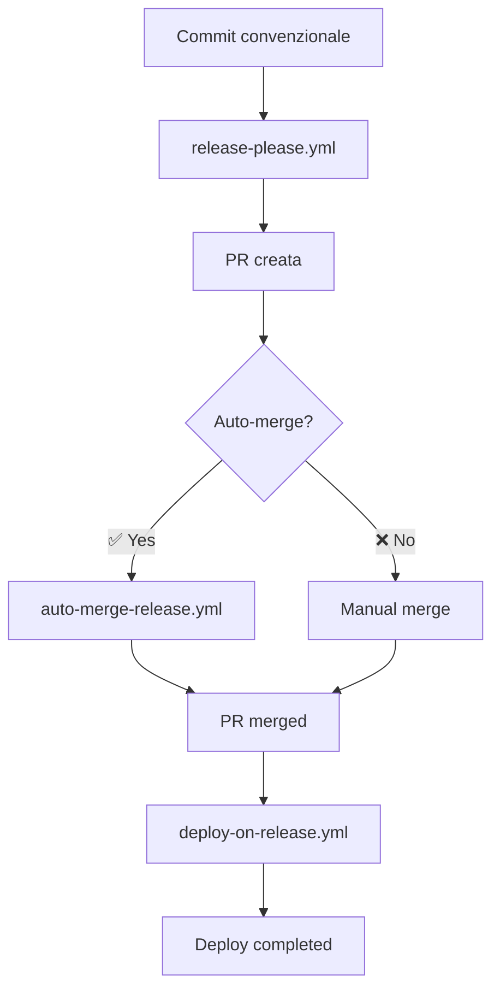
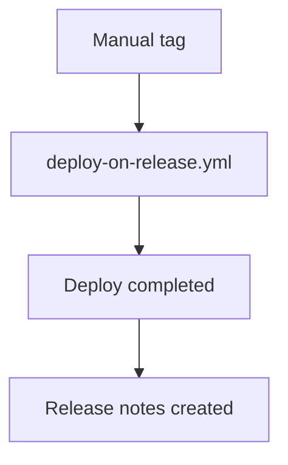

# Deploy su Merge Manuale - Configurazione Estesa

Questo documento spiega le modifiche implementate per supportare il deploy automatico sia per merge automatici che manuali delle PR di release.

## 🎯 **Obiettivo**

Garantire che il deploy in produzione si attivi **sempre** quando una PR di release viene mergiata, indipendentemente da come avviene il merge:

- ✅ **Auto-merge** (via workflow automatico)
- ✅ **Manual merge** (via UI GitHub o CLI)
- ✅ **Tag push** (fallback per release dirette)

## 🔧 **Configurazione Implementata**

### **Enhanced Trigger Conditions**

```yaml
if: |
  (github.event_name == 'pull_request' && 
   github.event.pull_request.merged == true &&
   (
     (startsWith(github.event.pull_request.title, 'chore') && contains(github.event.pull_request.title, 'release')) ||
     startsWith(github.event.pull_request.head.ref, 'release-please--') ||
     contains(github.event.pull_request.body, 'Release-As:') ||
     github.event.pull_request.user.login == 'github-actions[bot]'
   )) ||
  (github.event_name == 'push' && startsWith(github.ref, 'refs/tags/v'))
```

### **Multi-Layer Detection Strategy**

#### **1. Title-based Detection** 📋

```yaml
startsWith(github.event.pull_request.title, 'chore') &&
contains(github.event.pull_request.title, 'release')
```

- **Target:** PR standard di release-please
- **Esempio:** "chore: release 1.2.3"

#### **2. Branch-based Detection** 🌿

```yaml
startsWith(github.event.pull_request.head.ref, 'release-please--')
```

- **Target:** Branch automatici di release-please
- **Esempio:** "release-please--branches--main--components--lecce-digital-game"

#### **3. Body-based Detection** 📝

```yaml
contains(github.event.pull_request.body, 'Release-As:')
```

- **Target:** PR con release notes specifiche
- **Esempio:** Body contenente "Release-As: 1.2.3"

#### **4. User-based Detection** 🤖

```yaml
github.event.pull_request.user.login == 'github-actions[bot]'
```

- **Target:** PR create da GitHub Actions
- **Backup:** Catch-all per PR automatiche

## 📊 **Scenari Supportati**

### **Scenario 1: Auto-merge Completo** ✅

```
1. Commit feat: → release-please.yml
2. PR creata automaticamente
3. Auto-merge-release.yml → merge automatico
4. deploy-on-release.yml → deploy automatico
```

### **Scenario 2: Merge Manuale UI** ✅

```
1. Commit feat: → release-please.yml
2. PR creata automaticamente
3. Developer: Manual merge via GitHub UI
4. deploy-on-release.yml → deploy automatico
```

### **Scenario 3: Merge Manuale CLI** ✅

```
1. Commit feat: → release-please.yml
2. PR creata automaticamente
3. Developer: gh pr merge <PR> --squash
4. deploy-on-release.yml → deploy automatico
```

### **Scenario 4: Tag Push Diretto** ✅

```
1. Developer: git tag v1.2.3 && git push --tags
2. deploy-on-release.yml → deploy automatico
3. Release notes create automaticamente
```

## 🔍 **Enhanced Logging e Tracking**

### **Deployment Trigger Logging**

```javascript
console.log('🚀 DEPLOYMENT TRIGGERED BY PR MERGE');
console.log(`📋 PR #${pr.number}: ${pr.title}`);
console.log(`👤 Created by: ${pr.user.login} ${isBot ? '(bot)' : '(human)'}`);
console.log(`✅ Merged by: ${mergedBy}`);
console.log(`🤖 Merge type: ${mergeType}`);
```

### **Merge Type Detection**

```javascript
const isAutoMerge =
  mergedBy === 'github-actions[bot]' || mergedBy === pr.user.login;
const mergeType = isAutoMerge ? 'AUTOMATIC' : 'MANUAL';
```

### **Enhanced Notifications**

```javascript
body: `🚀 **Deployment completed!**

✅ Version \`${version}\` deployed successfully to production
📅 Deployed at: \`${timestamp}\`
🌐 Live URL: https://lecce-digital-game.web.app

**What happened:**
1. ✅ Release PR merged ${mergeType}
2. ✅ Production build completed  
3. ✅ Firebase hosting deployment successful
4. ✅ Application is now live

**Merge details:**
- 👤 Merged by: ${mergedBy}
- 🤖 Method: ${isAutoMerge ? 'Auto-merge' : 'Manual merge'}
- 📅 Merged at: ${pr.merged_at}`;
```

## 🛡️ **Sicurezza e Controlli**

### **False Positive Prevention**

- ✅ **Merge Required:** `github.event.pull_request.merged == true`
- ✅ **Multi-layer Validation:** 4 diverse strategie di detection
- ✅ **Target Branch:** Solo PR verso `main`
- ✅ **Event Type Check:** Solo `pull_request` closed o `push` tags

### **Manual Override Support**

- ✅ **Tag-based Deploy:** Sempre disponibile come fallback
- ✅ **Workflow Dispatch:** Manual trigger se necessario
- ✅ **CLI Deploy:** `npm run build && firebase deploy`

## 📋 **Testing Matrix**

### **Test Case 1: Standard Auto-merge**

```bash
git commit -m "feat: new feature"
git push
# Expected: Auto-creation → Auto-merge → Deploy
```

### **Test Case 2: Manual Merge UI**

```bash
git commit -m "feat: new feature"
git push
# Then: Manual merge via GitHub UI
# Expected: Deploy triggers automatically
```

### **Test Case 3: Manual Merge CLI**

```bash
git commit -m "feat: new feature"
git push
gh pr merge <PR_NUMBER> --squash
# Expected: Deploy triggers automatically
```

### **Test Case 4: Direct Tag**

```bash
git tag v1.2.3
git push --tags
# Expected: Deploy triggers from tag
```

### **Test Case 5: Non-release PR**

```bash
git commit -m "docs: update readme"
# Create regular PR and merge
# Expected: Deploy does NOT trigger
```

## 🔄 **Workflow Sequence**

### **Complete Automation Path:**



### **Manual Override Path:**



## 📊 **Metriche e Monitoring**

### **Success Indicators:**

- ✅ **Deploy Rate:** % di release PR che triggano deploy
- ✅ **Method Distribution:** Auto vs Manual merge ratio
- ✅ **Response Time:** Tempo da merge a deploy completato
- ✅ **Error Rate:** % di deploy falliti per tipo di merge

### **Monitoring Points:**

```bash
# Check deploy logs
gh run list --workflow=deploy-on-release.yml

# Check recent deployments
gh release list --limit 10

# Monitor Firebase deployments
firebase projects:list
```

## 🚨 **Troubleshooting**

### **Deploy Non Parte dopo Merge Manuale**

1. **Verifica Trigger:**

   ```bash
   # Check if PR was actually merged
   gh pr view <PR_NUMBER> --json merged,mergedBy
   ```

2. **Verifica Titolo/Branch:**

   ```bash
   # Check PR title and branch
   gh pr view <PR_NUMBER> --json title,headRefName
   ```

3. **Force Deploy Manuale:**
   ```bash
   # Manual deploy as fallback
   npm run build
   firebase deploy --only hosting
   ```

### **Deploy Triggera per PR Non-Release**

1. **Check Detection Logic:** Verifica che la PR non matchi criteri release
2. **Review Conditions:** Assicurati che tutti i checks siano appropriati
3. **Add Exclusions:** Aggiungi path-ignore se necessario

---

**Data Implementazione:** $(date)  
**Status:** ✅ ATTIVO - Deploy supporta merge automatici e manuali
