# Firebase Deployment Setup Guide

## Problema: `Input required and not supplied: firebaseServiceAccount`

Questo errore indica che il secret `FIREBASE_SERVICE_ACCOUNT_LECCE_DIGITAL_GAME` non è configurato nel repository GitHub.

## 🔧 Soluzione Step-by-Step

### 1. **Genera Service Account Firebase**

1. 🌐 **Vai alla Firebase Console:**

   ```
   https://console.firebase.google.com/project/lecce-digital-game/settings/serviceaccounts/adminsdk
   ```

2. 🔑 **Genera una nuova chiave privata:**
   - Clicca su **"Generate new private key"**
   - Conferma cliccando **"Generate key"**
   - Scarica il file JSON (non condividerlo mai!)

### 2. **Configura GitHub Secret**

1. 📝 **Vai alle settings del repository:**

   ```
   https://github.com/digital-community-le/lecce-digital-game/settings/secrets/actions
   ```

2. 🔐 **Crea nuovo secret:**
   - Clicca **"New repository secret"**
   - **Name:** `FIREBASE_SERVICE_ACCOUNT_LECCE_DIGITAL_GAME`
   - **Value:** [incolla l'intero contenuto del file JSON scaricato]

3. ✅ **Clicca "Add secret"**

### 3. **Verifica Configurazione**

Esegui questo comando per verificare tutto:

```bash
npm run check:firebase
```

### 4. **Test Deployment**

1. **Trigger manuale del workflow:**
   - Vai su [GitHub Actions](https://github.com/digital-community-le/lecce-digital-game/actions)
   - Seleziona workflow "Deploy on Release"
   - Clicca "Run workflow"

2. **Oppure merge una release PR** per attivare il deployment automatico

## 🔍 Risoluzione Problemi

### Errore: "Project lecce-digital-game does not exist"

Il progetto Firebase potrebbe non esistere o avere nome diverso.

**Soluzione:**

1. Verifica il nome progetto su [Firebase Console](https://console.firebase.google.com)
2. Aggiorna `projectId` in `.github/workflows/deploy-on-release.yml`

### Errore: "Permission denied"

Il service account non ha permessi sufficienti.

**Soluzione:**

1. Vai su [Firebase Console → IAM](https://console.firebase.google.com/project/lecce-digital-game/iam-admin/iam)
2. Trova il service account
3. Assegna ruolo **"Firebase Hosting Admin"**

### Errore: "Build output not found"

Il build non ha generato i file nella directory corretta.

**Soluzione:**

```bash
# Verifica che il build funzioni localmente
npm run build

# Controlla che esista dist/public/
ls -la dist/public/

# Se manca, aggiorna firebase.json:
{
  "hosting": {
    "public": "dist/public",  // Assicurati che punti alla directory corretta
    ...
  }
}
```

## 📋 Struttura File Firebase

### firebase.json

```json
{
  "hosting": {
    "public": "dist/public",
    "ignore": ["firebase.json", "**/.*", "**/node_modules/**"],
    "rewrites": [
      {
        "source": "**",
        "destination": "/index.html"
      }
    ]
  }
}
```

### Struttura Directory

```
project/
├── firebase.json           # Configurazione Firebase
├── dist/
│   └── public/            # Output del build
│       ├── index.html
│       ├── assets/
│       └── ...
└── .github/workflows/
    └── deploy-on-release.yml
```

## 🚀 Flusso Deployment Completo

```mermaid
graph TD
    A[Release PR merged] --> B[deploy-on-release.yml]
    B --> C[npm ci]
    C --> D[npm run build]
    D --> E[Verify Firebase config]
    E --> F[Check secrets]
    F --> G{Secret exists?}
    G -->|Yes| H[Deploy to Firebase]
    G -->|No| I[❌ Fail with instructions]
    H --> J[✅ Live on lecce-digital-game.web.app]
```



## 📞 Link Utili

- **Firebase Console:** https://console.firebase.google.com/project/lecce-digital-game
- **GitHub Secrets:** https://github.com/digital-community-le/lecce-digital-game/settings/secrets/actions
- **GitHub Actions:** https://github.com/digital-community-le/lecce-digital-game/actions
- **Deploy Workflow:** https://github.com/digital-community-le/lecce-digital-game/actions/workflows/deploy-on-release.yml

## 🛠️ Comandi Debug

```bash
# Verifica configurazione completa
npm run check:firebase

# Build locale per test
npm run build

# Lista files build
ls -la dist/public/

# Verifica firebase.json
cat firebase.json

# Test Firebase CLI (se installato)
firebase projects:list
firebase hosting:channel:list
```
