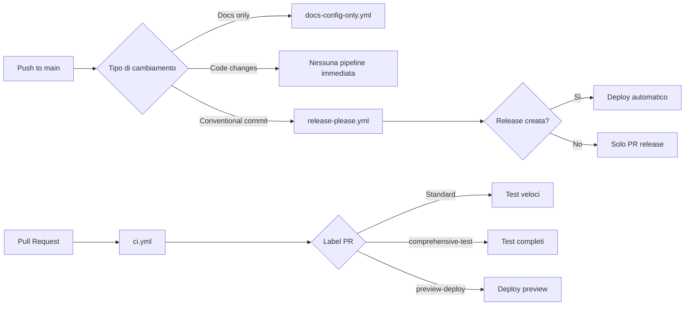

# GitHub Actions Pipeline Optimization

## 🎯 Panoramica

Questo documento descrive l'ottimizzazione delle pipeline GitHub Actions per ridurre ridondanze e migliorare l'efficienza del processo CI/CD.

## ⚠️ Problema Identificato

**Situazione Precedente**:

- 3 pipeline partivano simultaneamente su ogni push su `main`
- Operazioni duplicate (TypeScript check, npm ci, test)
- **Doppio deploy** quando veniva creata una release
- Spreco di risorse GitHub Actions

## ✅ Soluzione Implementata

### 📋 Strategia Pipeline Ottimizzata



## 🔧 Pipeline Configurate

### 1. **Release Please** (`.github/workflows/release-please.yml`)

**Trigger**: Ogni push su `main`
**Funzione**: Gestione semantic versioning e deploy di produzione

```yaml
# Sempre eseguito: Crea/aggiorna PR release
# Solo su release: Deploy completo a Firebase
```

**Caratteristiche**:

- ✅ Deploy automatico solo su release effettiva
- ✅ Test completi prima del deploy
- ✅ Coverage obbligatoria
- ✅ Commento automatico con status

### 2. **Continuous Integration** (`.github/workflows/ci.yml`)

**Trigger**: Pull Request verso `main`
**Funzione**: Validazione veloce e test approfonditi

```yaml
jobs:
  validate: # Sempre eseguito (veloce)
  comprehensive: # Solo con label "comprehensive-test"
  preview-deploy: # Solo con label "preview-deploy"
```

**Caratteristiche**:

- ✅ Test veloci per default
- ✅ Test completi on-demand
- ✅ Preview deploy opzionale
- ✅ Nessun push automatico su main

### 3. **Documentation Changes** (`.github/workflows/docs-config-only.yml`)

**Trigger**: Cambi solo a docs, README, scripts, config
**Funzione**: Validazione leggera senza full CI

```yaml
# Conditional execution basata sui file cambiati
# Solo operazioni necessarie
```

**Caratteristiche**:

- ✅ Esecuzione condizionale
- ✅ Solo dipendenze necessarie
- ✅ Validazione mirata

### 4. **Firebase PR Preview** (`.github/workflows/firebase-hosting-pull-request.yml`)

**Trigger**: Pull Request (automatico Firebase)
**Funzione**: Deploy automatico preview per PR

**Caratteristiche**:

- ✅ Gestito automaticamente da Firebase
- ✅ URL preview automatico
- ✅ Cleanup automatico alla chiusura PR

## 📊 Confronto Performance

### Prima dell'Ottimizzazione

```
Push su main (con code changes):
├── Documentation Changes     (~2-3 min)
├── Release Please           (~1-5 min)
└── Firebase Hosting Merge   (~4-5 min)
Total: 3 pipeline parallele, 7-13 min di compute

Release commit:
├── Release Please → Deploy  (~5-6 min)
└── Firebase Hosting Merge   (~4-5 min)
Total: 2 deploy simultanei! 🚨
```

### Dopo l'Ottimizzazione

```
Push su main (con code changes):
└── Release Please           (~1 min, no deploy)
Total: 1 pipeline, 1 min di compute

Release commit:
└── Release Please → Deploy  (~5-6 min)
Total: 1 deploy controllato ✅

PR Review:
├── CI Validate             (~2-3 min)
├── CI Comprehensive        (solo se richiesto)
└── Firebase PR Preview     (automatico)
Total: Controllo granulare
```

## 🚀 Benefici dell'Ottimizzazione

### Efficienza Risorse

- **-67% pipeline su push main** (da 3 a 1)
- **-50% tempo di compute** per push normali
- **100% eliminazione deploy duplicati**

### Controllo Qualità

- ✅ Test completi **solo** prima del deploy production
- ✅ Preview deploy **opzionale** per PR
- ✅ Feedback veloce su PR standard

### Developer Experience

- ✅ Feedback più veloce su push
- ✅ Meno notifiche spam
- ✅ Deploy controllati e tracciabili

## 🏷️ Utilizzo Labels per PR

Per controllare il comportamento delle pipeline sulle PR:

### Labels Disponibili

- **`comprehensive-test`**: Esegue test completi + coverage
- **`preview-deploy`**: Crea deploy preview su Firebase
- **`docs-only`**: Cambi solo documentazione (auto-detected)

### Esempi Uso

```bash
# PR normale (solo test veloci)
gh pr create --title "feat: add new component"

# PR con test completi
gh pr create --title "refactor: core architecture" --label "comprehensive-test"

# PR con preview deploy
gh pr create --title "feat: new UI design" --label "preview-deploy"

# PR critica (entrambi)
gh pr create --title "feat: payment integration" \
  --label "comprehensive-test,preview-deploy"
```

## 🔍 Monitoraggio e Debug

### Verifica Status Pipeline

```bash
# Controlla status ultima release
gh run list --workflow=release-please.yml --limit=1

# Controlla CI su PR corrente
gh pr checks

# Vedi log completo pipeline
gh run view <run-id> --log
```

### Debug Problemi Comuni

1. **Release non creata automaticamente**

   ```bash
   # Verifica conventional commits
   git log --oneline -5
   # Deve contenere: feat:, fix:, BREAKING CHANGE:
   ```

2. **Deploy fallito**

   ```bash
   # Controlla secrets Firebase
   gh secret list
   # Deve contenere: FIREBASE_SERVICE_ACCOUNT_LECCE_DIGITAL_LEGENDS
   ```

3. **Test falliti su CI**
   ```bash
   # Esegui test localmente
   npm run test:smart
   npm run check
   ```

## 📝 Migration Notes

### Cambiamenti Breaking

- ❌ **Rimosso**: `firebase-hosting-merge.yml`
- ✅ **Nuovo**: CI granulare con labels
- ✅ **Migliorato**: Release Please con deploy integrato

### Configurazioni Migrate

- Release Please ora include il deploy Firebase
- CI separato per PR validation
- Documentation workflow ottimizzato

### Next Steps

1. ✅ Testare con una PR di prova
2. ✅ Verificare deploy su release
3. ✅ Aggiornare team sui nuovi labels
4. ✅ Monitorare performance primi giorni

---

## 🤝 Contributing

Quando contribuisci:

1. **PR normali**: Nessuna azione speciale
2. **Cambi critici**: Aggiungi label `comprehensive-test`
3. **Nuove UI**: Aggiungi label `preview-deploy`
4. **Release**: Usa conventional commits (`feat:`, `fix:`, `BREAKING:`)

---

_Documentazione aggiornata: Settembre 2025_
