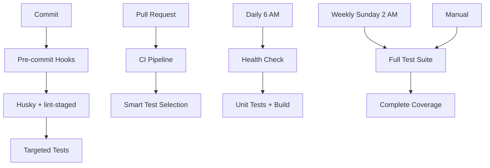

# Testing Strategy

## Overview

Il nostro sistema di testing è strutturato su **tre livelli** per bilanciare performance e affidabilità:

## 🏗️ Architettura Testing



## 📊 Workflow Comparison

| Workflow | Frequenza | Scopo | Performance | Coverage |
|----------|-----------|-------|-------------|----------|
| **ci.yml** | PR/Push | Smart testing | ⚡ Fast | 📊 Targeted |
| **Daily Health Check** | Giornaliera | Regression check | ⚡ Fast | 🔍 Basic |
| **Full Test Suite** | Settimanale/Manual | Complete analysis | 🐌 Thorough | 📈 Complete |

## 🎯 Smart Test Selection

### Pre-commit (Locale)
```bash
# Solo file modificati
npm run test:smart:local
```

### CI Pipeline (automatico)
```bash
# Basato sui file modificati nella PR
npm run test:smart:ci
```

### Trigger Patterns

| Pattern File | Test Type | Esempio |
|--------------|-----------|---------|
| `src/**/*.ts` | Unit + Integration | Component changes |
| `server/**` | Integration + E2E | API changes |
| `*.config.*` | Full suite | Config changes |

## 🔄 Workflow Details

### 1. Daily Health Check (`scheduled-tests.yml`)
- **Quando**: Ogni giorno alle 6 AM UTC
- **Cosa**: Unit tests + type checking + build
- **Perché**: Rileva regressioni rapidamente
- **Performance**: ~3-5 minuti

### 2. Full Test Suite (`full-test.yml`)
- **Quando**: Domenica 2 AM UTC + manuale
- **Cosa**: Test completi + coverage + artifacts
- **Perché**: Analisi completa settimanale
- **Performance**: ~15-20 minuti

### 3. CI Pipeline (`ci.yml`)
- **Quando**: PR e push
- **Cosa**: Smart test selection
- **Perché**: Feedback rapido durante sviluppo
- **Performance**: ~5-10 minuti

## 🚨 Failure Handling

### Health Check
- ❌ Fallimento → Crea issue automatica
- 👥 Notifica team
- 🔍 Link ai logs

### Full Test Suite
- ❌ Fallimento → Upload artifacts
- 📊 Coverage report
- 💬 Commento dettagliato

## ⚡ Performance Optimizations

1. **Matrix Strategy**: Parallel testing Node.js 20.x e 22.x
2. **Smart Selection**: Test solo file rilevanti
3. **Caching**: npm cache per dependencies
4. **Artifacts**: Solo quando necessario

## 🔧 Local Development

```bash
# Test rapidi durante sviluppo
npm run test:watch

# Test pre-commit (automatico)
git commit # Trigger husky hooks

# Test completi locali
npm run test:coverage

# Performance check
npm run test:performance
```

## 📈 Metrics & Monitoring

- **Coverage Target**: >80% per components critici
- **Performance Target**: CI < 10 minuti
- **Failure Rate Target**: <5% daily health checks

## 🎛️ Configuration

### Vitest Config
- **Environment**: jsdom per React components
- **Coverage**: c8 provider
- **Reporters**: verbose + junit per CI

### Husky Hooks
- **pre-commit**: lint-staged + targeted tests
- **commit-msg**: conventional commits validation

## 🚀 Best Practices

1. **Scrivi test mentre sviluppi** (TDD approach)
2. **Usa smart test selection** in CI
3. **Monitora coverage trends**
4. **Review failure patterns** settimanalmente
5. **Ottimizza test lenti** regolarmente

## 🔄 Continuous Improvement

- **Weekly**: Review failure patterns
- **Monthly**: Optimize slow tests
- **Quarterly**: Review testing strategy

---

*Per domande o miglioramenti, consulta [DEVELOPMENT.md](./DEVELOPMENT.md)*
