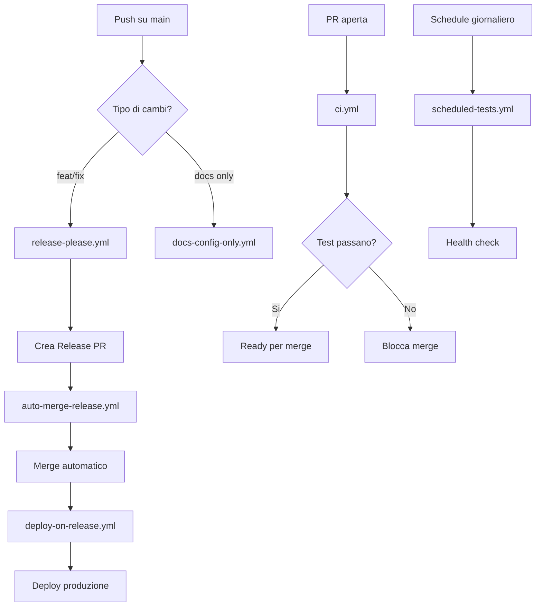

# Workflow GitHub Actions - Stato Attuale

## Workflow Attivi

### 🚀 **Deploy e Release**

- **`release-please.yml`** - Gestisce release automatiche e PR di versioning
- **`deploy-on-release.yml`** - Deploy produzione dopo merge di release PR
- **`auto-merge-release.yml`** - Auto-merge delle release PR dopo validazione

### 🧪 **Testing e CI**

- **`ci.yml`** - Continuous Integration per PR e push
- **`full-test.yml`** - Test completi su richiesta
- **`scheduled-tests.yml`** - Controlli di salute giornalieri automatici

### 📚 **Documentazione e Utilità**

- **`docs-config-only.yml`** - Validazione per cambi solo di documentazione
- **`test-permissions.yml`** - Test permessi GitHub Actions

## Workflow Rimossi (Obsoleti)

### ❌ **Rimossi in questa pulizia:**

- **`auto-merge-release-backup.yml`** - Backup obsoleto del sistema auto-merge
- **`auto-merge-release-new.yml`** - Versione sperimentale sostituita
- **`firebase-hosting-pull-request.yml`** - Workflow disabilitato sostituito da ci.yml

## Struttura del Sistema CI/CD

## Descrizione Workflow

### 🔄 **Flusso normale di sviluppo:**

1. **PR aperta** → `ci.yml` esegue test e validazioni
2. **PR mergiata su main** → `release-please.yml` analizza commit
3. **Se necessario** → Crea release PR con CHANGELOG
4. **Release PR** → `auto-merge-release.yml` fa merge automatico
5. **Merge completato** → `deploy-on-release.yml` fa deploy produzione

### 🛠️ **Workflow di utilità:**

- **`test-permissions.yml`** - Diagnostica permessi (esecuzione manuale)
- **`docs-config-only.yml`** - Validazione leggera per cambi documentazione
- **`scheduled-tests.yml`** - Controlli di salute automatici

### 🧪 **Test avanzati:**

- **`full-test.yml`** - Test completi con coverage (esecuzione manuale)

## Ottimizzazioni Implementate

### ✅ **Performance:**

- Test intelligenti che eseguono solo test rilevanti
- Path filtering per eseguire workflow solo quando necessario
- Cache aggressive per dipendenze npm

### ✅ **Resilienza:**

- Try-catch su tutte le operazioni di commento
- Workflow non falliscono per problemi di permessi
- Fallback automatici per auto-merge

### ✅ **Sicurezza:**

- Permessi minimi necessari per ogni workflow
- Validazione commit message
- Pre-commit hooks

## Manutenzione

### 🔍 **Monitoraggio consigliato:**

1. Verificare weekly gli scheduled tests
2. Controllare che release-please funzioni correttamente
3. Monitorare successo del deploy automatico

### 🛠️ **Debug:**

- Usare `npm run check:permissions` per problemi di permessi
- Workflow `test-permissions.yml` per diagnosi completa
- Consultare `docs/GITHUB_PERMISSIONS_GUIDE.md` per risoluzione problemi
